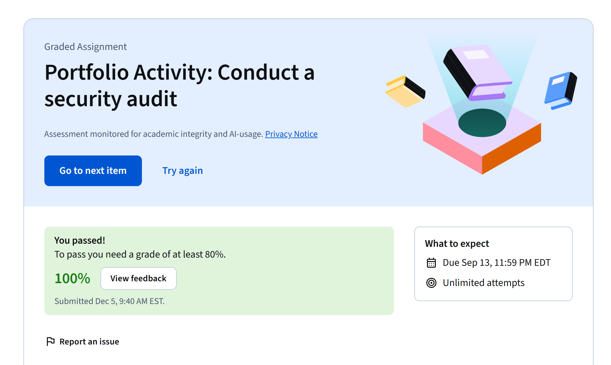

# Botium Toys Security Audit

**Type:** Google Cybersecurity Professional Certificate portfolio activity  
**Course:** Play It Safe: Manage Security Risks  
**Scenario:** Botium Toys, a fictional company provided by the course  
**Result:** Completed with a 100% grade

## Overview

I completed a graded security audit activity based on the fictional Botium Toys scenario. The activity focused on reviewing organizational risks, evaluating security controls, and considering compliance requirements.

## Scope and My Contribution

Botium Toys and its business environment were supplied as a course scenario. My role was to work through the audit activity and apply the security frameworks, controls, and risk-management concepts taught in Course 2 of the Google Cybersecurity Professional Certificate.

## Audit Process

The activity required a structured review of the organization's security posture:

1. Review the audit scope, goals, assets, and risk information supplied in the scenario.
2. Evaluate administrative, technical, and physical security controls.
3. Consider whether the control environment addressed applicable compliance needs.
4. Identify control gaps and areas where the organization could reduce risk.

## Skills Demonstrated

- Security auditing
- Risk and vulnerability assessment
- Security control evaluation
- Application of security frameworks
- Compliance awareness
- Written analysis

## Completion Evidence

The screenshot shows a 100% grade for the Coursera assignment titled **Portfolio Activity: Conduct a security audit**.

## Outcome and Limitations

Coursera records the activity as completed with a 100% grade. My original audit worksheet is no longer available, so this page does not recreate or claim specific findings from that submission. The evidence supports completion of the activity, while the project summary describes the skills and process assessed by the course.

## Reference

- [Play It Safe: Manage Security Risks on Coursera](https://www.coursera.org/learn/manage-security-risks)
